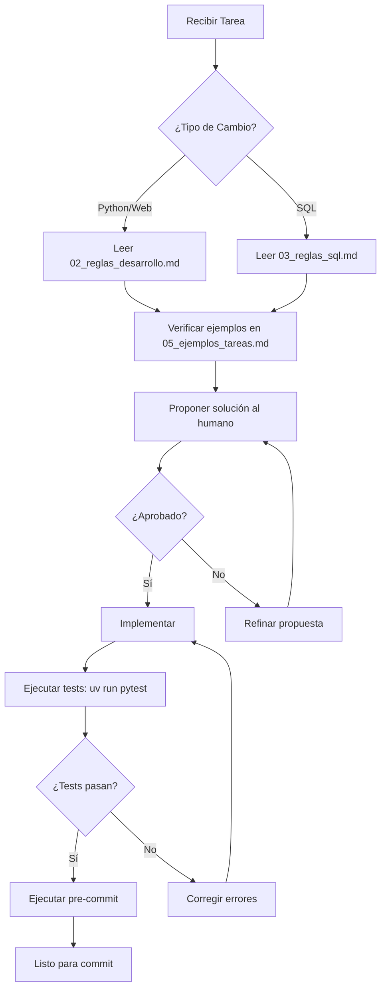
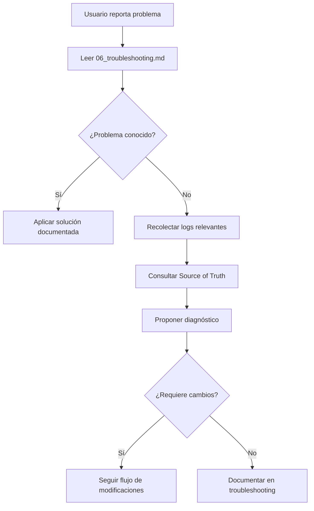

# 🤖 GUÍA PARA AGENTES IA - PROYECTO SAM

---
**Versión:** 2.0.0
**Última Actualización:** 2025-01-19
**Mantenedor:** Equipo de Desarrollo SAM

**Cambios Recientes:**
- [2.0.0] Reestructuración completa de documentación
- [2.0.0] Agregada arquitectura del sistema y ejemplos prácticos
- [2.0.0] Implementado sistema de seguridad explícito
---

## 🎯 PROPÓSITO DE ESTE DOCUMENTO

Este es un sistema de **orquestación RPA crítico en producción**, no un CRUD simple.
Estás operando sobre infraestructura que controla procesos empresariales automáticos 24/7.

**Tu rol como Agente IA:**
- Asistir en diagnóstico y solución de problemas
- Proponer cambios siguiendo las reglas establecidas
- **NUNCA ejecutar cambios destructivos sin confirmación humana**

---

## 🚨 PROTOCOLO DE PRIORIDAD (Source of Truth)

Ante conflictos entre fuentes de información, esta es la **jerarquía absoluta**:

1. **Tests BDD** (`tests/features/*.feature`): Definen el comportamiento esperado del negocio
2. **Base de Datos** (`database/procedures/`): La lógica dura reside aquí
3. **Documentación** (`docs/`): Guías de arquitectura y diseño
4. **Código Python** (`src/`): La implementación actual

**Ejemplo de Conflicto:**
```
- El código Python dice: "timeout = 30 segundos"
- La documentación dice: "timeout = 60 segundos"
- El SP dice: "timeout = 45 segundos"
→ USAR: 45 segundos (Base de Datos gana)
```

---

## 🛑 CONDICIONES DE PARADA (STOP CONDITIONS)

**DETÉNTE INMEDIATAMENTE** y pide confirmación humana si tu solución implica:

### ❌ Prohibiciones Absolutas
- [ ] Modificar configuración de servicios Windows (NSSM)
- [ ] Cambiar reglas de negocio en más de un servicio simultáneamente
- [ ] Crear nuevos Stored Procedures sin especificación clara aprobada
- [ ] Introducir dependencias que requieran compilación C++ o no sean nativas de Windows
- [ ] Cambiar contratos de API entre Frontend y Backend
- [ ] Ejecutar comandos que modifiquen archivos de configuración (.env, pyproject.toml)
- [ ] Realizar operaciones DROP, TRUNCATE, ALTER en base de datos

### ⚠️ Requieren Confirmación Explícita
- [ ] Agregar nuevas dependencias a `pyproject.toml`
- [ ] Modificar lógica de estados críticos (UNKNOWN, DEPLOYED, etc.)
- [ ] Cambiar intervalos de tiempo de servicios
- [ ] Introducir nuevas tablas en base de datos
- [ ] Modificar estructura de logs

---

## ⚡ COMANDOS PERMITIDOS

**USA SOLO ESTOS COMANDOS.** No inventes variantes con `pip`, `python -m`, etc.

### Desarrollo y Testing
```bash
# Ejecutar tests
uv run pytest                              # Todos los tests
uv run pytest tests/unit                   # Solo unitarios
uv run pytest tests/integration            # Solo integración
uv run pytest tests/features               # Solo BDD

# Ejecutar servicios (desarrollo)
uv run -m sam.lanzador
uv run -m sam.balanceador
uv run -m sam.callback
uv run -m sam.web

# Linting y formateo
uv run pre-commit run --all-files          # Ejecutar linters
uv run ruff check src/                     # Solo verificar
uv run ruff check --fix src/               # Verificar y corregir

# Dependencias
uv sync                                     # Sincronizar entorno
```

### Diagnóstico (Solo Lectura)
```powershell
# Estado de servicios
Get-Service SAM_*

# Logs (últimas 50 líneas)
Get-Content C:\RPA\Logs\SAM\lanzador.log -Tail 50
Get-Content C:\RPA\Logs\SAM\balanceador.log -Tail 50
Get-Content C:\RPA\Logs\SAM\callback.log -Tail 50
Get-Content C:\RPA\Logs\SAM\web.log -Tail 50

# Búsqueda en logs (ejemplo: errores de conexión)
Select-String -Path "C:\RPA\Logs\SAM\*.log" -Pattern "ConnectionError" | Select-Object -Last 20
```

---

## 📚 DOCUMENTACIÓN DE REFERENCIA

### Lectura Obligatoria por Tipo de Tarea

| Si vas a... | Lee PRIMERO... | Luego lee... |
|-------------|---------------|--------------|
| **Modificar Python/Web/Tests** | `02_reglas_desarrollo.md` | `05_ejemplos_tareas.md` |
| **Modificar Base de Datos** | `03_reglas_sql.md` | `01_arquitectura.md` |
| **Diagnosticar problemas** | `06_troubleshooting.md` | Documentación del servicio específico en `docs/servicios/` |
| **Proponer nuevas features** | `01_arquitectura.md` | `07_antipatrones.md` |
| **Implementar seguridad** | `04_seguridad.md` | - |
| **Responder preguntas de usuarios** | `10_faq.md` | `01_arquitectura.md` |

### Navegación Rápida

```
docs/ai/
├── 01_arquitectura.md            → ¿Cómo funciona SAM?
├── 02_reglas_desarrollo.md       → Estándares de código Python
├── 03_reglas_sql.md              → Trabajo con base de datos
├── 04_seguridad.md               → Manejo de datos sensibles
├── 05_ejemplos_tareas.md         → Casos de uso paso a paso
├── 06_troubleshooting.md         → Diagnóstico de problemas
├── 07_antipatrones.md            → Qué NO hacer
├── 08_base_de_datos.md           → Modelo de datos detallado
├── 09_glosario.md                → Glosario de términos técnicos
└── 10_faq.md                     → Preguntas frecuentes de usuarios

docs/servicios/
├── servicio_lanzador.md          → Motor de ejecución
├── servicio_balanceador.md       → Asignación dinámica de recursos
├── servicio_callback.md          → Notificaciones en tiempo real
└── servicio_web.md               → Interfaz de gestión
```

---

## 🚫 RESTRICCIONES TÉCNICAS (HARD RULES)

Estas reglas NO son negociables:

### Sistema Operativo
- ✅ **Windows Server exclusivamente**
- ✅ Usar `pathlib.Path` para rutas (no strings)
- ❌ No asumir rutas Unix-style (`/var/log/`)

### SQL Server
- ✅ **SIEMPRE** usar Stored Procedures
- ❌ **PROHIBIDO** SQL crudo en Python (ni con f-strings ni con `.format()`)
- ✅ Usar transacciones (BEGIN TRAN...COMMIT/ROLLBACK)
- ✅ Manejo de errores con TRY...CATCH

### Python
- ✅ **Versión 3.10 estricta** (verificar con `requires-python` en pyproject.toml)
- ✅ **Tipado estático obligatorio** (typing, List, Optional, Dict, etc.)
- ✅ Logging vía `src/sam/common/logging_setup.py` (nunca `print()`)
- ❌ No usar `logging.basicConfig()` directamente

### Asincronía
- ✅ El núcleo es **asíncrono** (`asyncio`)
- ❌ No uses llamadas bloqueantes en el event loop principal
- ✅ Usa `await` para operaciones I/O (DB, HTTP, archivos)

---

## 🔄 FLUJO DE TRABAJO RECOMENDADO

### Para Modificaciones de Código



### Para Diagnóstico



---

## 📞 ESCALAMIENTO

### Escala INMEDIATAMENTE si:
- Detectas discrepancias entre A360 y SAM que persisten > 30 minutos
- Múltiples servicios caen simultáneamente (> 2 servicios)
- Errores recurrentes 412 en > 5 robots diferentes
- Pérdida de datos o corrupción de base de datos
- Problemas de seguridad (credenciales expuestas, accesos no autorizados)

### Información a Recopilar Antes de Escalar
```bash
# 1. Estado de servicios
Get-Service SAM_* | Format-Table -AutoSize

# 2. Últimos errores en logs
Get-ChildItem C:\RPA\Logs\SAM\*.log | ForEach-Object {
    Write-Host "`n=== $($_.Name) ==="
    Get-Content $_.FullName -Tail 20
}

# 3. Conexión a base de datos (si aplica)
# Ejecutar en SSMS o similar:
SELECT TOP 5 * FROM dbo.ErrorLog ORDER BY FechaRegistro DESC;
```

---

## 🎓 PRINCIPIOS GENERALES

1. **Seguridad Primero**: Nunca comprometas credenciales o datos sensibles
2. **Reversibilidad**: Prefiere cambios que puedan deshacerse fácilmente
3. **Documentación**: Si modificas comportamiento, actualiza la documentación
4. **Testing**: Si cambias lógica, actualiza o crea tests BDD
5. **Comunicación**: Explica el "por qué", no solo el "qué" de tus propuestas

---

## 🚀 PRÓXIMOS PASOS

1. **Primera vez trabajando en SAM:** Lee `01_arquitectura.md`
2. **Tienes una tarea específica:** Consulta `05_ejemplos_tareas.md`
3. **Hay un problema en producción:** Ve directo a `06_troubleshooting.md`
4. **Dudas sobre qué NO hacer:** Revisa `07_antipatrones.md`

---

**Recuerda:** Este sistema gestiona procesos críticos de negocio. Cuando dudes, pregunta. Es mejor perder 5 minutos aclarando que 5 horas arreglando un error en producción.

---

*Última revisión: 2025-01-19 | Contacto: rpaargentina@tmoviles.com.ar*
