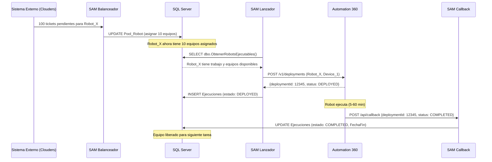
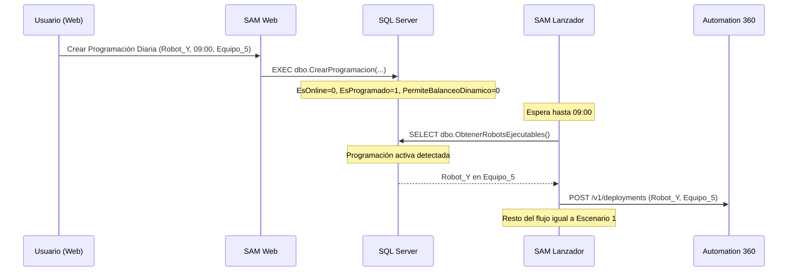
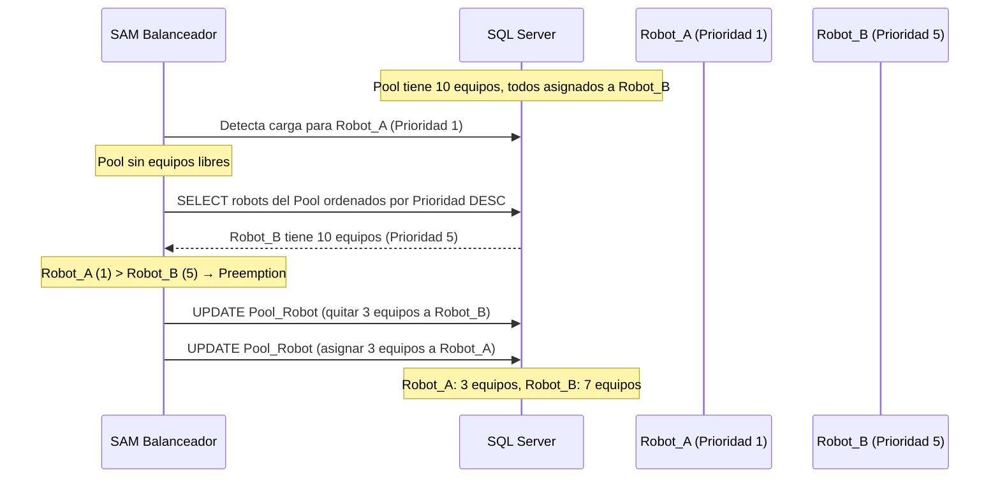

# 🏗️ ARQUITECTURA DEL SISTEMA SAM

---
**Versión:** 1.0.0
**Última Actualización:** 2025-01-19
---

## 📋 ÍNDICE

1. [Visión General](#visión-general)
2. [Componentes del Sistema](#componentes-del-sistema)
3. [Flujo de Datos](#flujo-de-datos)
4. [Stack Tecnológico](#stack-tecnológico)
5. [Modelo de Base de Datos](#modelo-de-base-de-datos)
6. [Patrones de Diseño](#patrones-de-diseño)
7. [Consideraciones de Escalabilidad](#consideraciones-de-escalabilidad)

---

## 🎯 VISIÓN GENERAL

### ¿Qué es SAM?

**SAM (Sistema Automático de Robots)** es un orquestador RPA empresarial que gestiona la ejecución de robots construidos sobre **Automation Anywhere 360 (A360)**.

### ¿Por qué existe SAM?

El agendador nativo de A360 tiene limitaciones:
- ❌ No permite balanceo dinámico de carga
- ❌ No prioriza automáticamente según demanda
- ❌ No gestiona pools de equipos inteligentemente
- ❌ Monitoreo limitado de estados UNKNOWN

**SAM añade:**
- ✅ Balanceo dinámico de carga entre pools
- ✅ Priorización inteligente (1-100)
- ✅ Gestión de colas y demanda en tiempo real
- ✅ Monitoreo avanzado con recuperación automática

### Analogía del Sistema

```
SAM es como un centro de control de taxis:

┌─────────────────────────────────────────────────────┐
│  A360 (Control Room) = Flota de Taxis              │
│  - Tiene los vehículos (Bot Runners)               │
│  - Tiene los conductores (Bots)                    │
│  - Pero NO decide estratégicamente a dónde enviarlos│
└─────────────────────────────────────────────────────┘
                           ↓
┌─────────────────────────────────────────────────────┐
│  SAM = Centro de Despacho Inteligente              │
│  - Monitorea demanda (tickets pendientes)          │
│  - Asigna taxis estratégicamente                   │
│  - Prioriza emergencias sobre viajes normales      │
│  - Balancea zonas con alta demanda                 │
└─────────────────────────────────────────────────────┘
```

---

## 🧩 COMPONENTES DEL SISTEMA

SAM opera mediante **4 microservicios independientes** que corren como servicios de Windows:

### 1. 🚀 Servicio Lanzador (`sam.lanzador`)

**Rol:** El Motor - Ejecutor Principal

**Responsabilidades:**
- Consulta BD buscando tareas pendientes
- Despliega robots vía API de A360
- Monitorea ejecuciones activas (Conciliador)
- Sincroniza catálogos de robots/equipos (Sincronizador)

**Componentes Internos:**
```
sam.lanzador/
├── service/
│   ├── desplegador.py      → Ejecuta robots
│   ├── conciliador.py      → Audita estados
│   └── sincronizador.py    → Actualiza maestros
├── api_client.py           → Cliente API A360
└── run_lanzador.py         → Entry point
```

**Ciclos de Ejecución:**
| Ciclo | Frecuencia | Función |
|-------|-----------|---------|
| Launcher | 15 seg | Buscar pendientes y disparar |
| Conciliador | 5-15 min | Auditar estados |
| Sync | 1 hora | Actualizar catálogos |

**Características Críticas:**
- ✅ Manejo de estado `UNKNOWN` (pérdida de comunicación A360)
- ✅ Reintentos inteligentes para errores 412 temporales
- ✅ Sistema de alertas clasificadas (CRITICAL/HIGH/MEDIUM)
- ✅ Parámetros de entrada personalizables por robot

---

### 2. ⚖️ Servicio Balanceador (`sam.balanceador`)

**Rol:** El Estratega - Optimizador de Recursos

**Responsabilidades:**
- Monitorea demanda externa (Clouders, RPA360 Work Queues)
- Asigna/desasigna equipos dinámicamente
- Aplica priorización estricta (Preemption)
- Gestiona cooldown para evitar fluctuaciones

**Componentes Internos:**
```
sam.balanceador/
├── service/
│   ├── proveedores.py         → Conectores de carga
│   ├── algoritmo_balanceo.py  → Lógica de asignación
│   └── cooling_manager.py     → Estabilizador
└── run_balanceador.py         → Entry point
```

**Proveedores de Carga:**
```python
# Extensible: implementa la interfaz ProveedorCarga
class ProveedorCarga(ABC):
    @abstractmethod
    async def obtener_carga(self) -> Dict[str, int]:
        """Retorna {nombre_robot: tickets_pendientes}"""
        pass
```

**Algoritmo de Balanceo:**
```
1. Recolectar carga de todos los proveedores
2. Filtrar pools en cooling (recientemente modificados)
3. Para cada robot con carga:
   a. Calcular equipos necesarios = carga / tickets_por_equipo
   b. Comparar con equipos actuales
   c. Si necesita más: Scaling Out
   d. Si necesita menos: Scaling In
4. Aplicar Preemption (quitar a baja prioridad para dar a alta)
5. Marcar pools modificados en cooling
```

**Configuración Dinámica (tabla ConfiguracionSistema):**
- `BALANCEADOR_POOL_AISLAMIENTO_ESTRICTO`: true/false
- `BALANCEADOR_LOG_LEVEL`: DEBUG/INFO

---

### 3. 📞 Servicio Callback (`sam.callback`)

**Rol:** El Oído - Receptor Tiempo Real

**Responsabilidades:**
- Recibe notificaciones HTTP desde A360
- Valida autenticación dual (Token estático + JWT)
- Actualiza BD inmediatamente al finalizar robot

**Componentes Internos:**
```
sam.callback/
├── api/
│   ├── auth.py           → Validación de tokens
│   └── endpoints.py      → POST /api/callback
└── run_callback.py       → Entry point (FastAPI)
```

**Flujo de Notificación:**
```
A360 Robot termina
    ↓
A360 envía POST con:
  - Headers:
      * X-Authorization: {CALLBACK_TOKEN}
      * Authorization: Bearer {JWT}
  - Body: {deploymentId, status, timestamps}
    ↓
SAM Callback valida tokens
    ↓
SAM actualiza dbo.Ejecuciones
```

**Modos de Autenticación:**
- `optional`: Acepta si CUALQUIERA es válido
- `required`: Requiere AMBOS válidos
- `none`: Sin validación (solo desarrollo)

---

### 4. 🖥️ Servicio Web (`sam.web`)

**Rol:** La Consola - Interfaz de Gestión ABM

**Responsabilidades:**
- Gestión de Robots, Equipos, Pools
- Configuración de Prioridades y Límites
- Creación de Programaciones
- Gestión de Mapeos (nombre externo → interno)

**Stack Tecnológico:**
- **Backend:** FastAPI (REST API asíncrona)
- **Frontend:** ReactPy (UI declarativa basada en componentes Python)
- **Estilos:** PicoCSS (Framework minimalista) + dashboard.css (Custom)
- **Interactividad:** HTMX + ReactPy Hooks (sin dependencias de Node.js)

**Arquitectura Frontend (Patrón Hook-Component):**
El frontend sigue un patrón donde los **Componentes** solo se encargan de la estructura visual, mientras que los **Hooks** gestionan la lógica y los datos.

```
src/sam/web/frontend/
├── api/                       # Comunicación con Backend
│   └── api_client.py          # Cliente único para peticiones REST
├── state/                     # Estado Global
│   └── app_context.py         # Contexto compartido (Notificaciones, Auth)
├── hooks/                     # Lógica de Negocio y Estado Local
│   ├── use_robots_hook.py     # Gestión de carga, filtros y acciones de robots
│   ├── use_equipos_hook.py    # Lógica para gestión de devices
│   └── use_schedules_hook.py  # Lógica de programaciones
├── shared/                    # Componentes UI Reutilizables
│   ├── data_table.py          # Grilla estandarizada con búsqueda y paginación
│   ├── async_content.py       # Wrapper para estados Loading/Error/Empty
│   ├── common_components.py   # Botones, Badges, Overlays
│   └── notifications.py       # Sistema de Toasts/Alertas
├── features/
│   ├── components/            # Vistas Principales (Páginas)
│   │   ├── robot_list.py      # Dashboard de Robots
│   │   ├── equipo_list.py     # Gestión de Equipos
│   │   └── mappings_page.py   # Mapeos de nombres externos
│   └── modals/                # Formularios y Diálogos
│       ├── robots_modals.py   # Edición/Asignación de robots
│       └── pool_modals.py     # Configuración de pools
└── app.py                     # Router principal y Layout base
```

---

## 🔄 FLUJO DE DATOS

### Escenario 1: Ejecución por Demanda (Online)



### Escenario 2: Ejecución Programada (Scheduled)



### Escenario 3: Preemption (Prioridad Estricta)



---

## 🛠️ STACK TECNOLÓGICO

### Infraestructura

| Componente | Tecnología | Versión | Notas |
|-----------|-----------|---------|-------|
| **OS** | Windows Server | 2019+ | Servicios gestionados con NSSM |
| **Python** | CPython | 3.10 | Strict requirement |
| **Base de Datos** | SQL Server | 2017+ | Single source of truth |
| **Gestor de Servicios** | NSSM | 2.24+ | Non-Sucking Service Manager |
| **Package Manager** | uv | Latest | Reemplazo de pip/venv |

### Backend

| Componente | Tecnología | Uso |
|-----------|-----------|-----|
| **Web Framework** | FastAPI | API REST + Callback |
| **HTTP Client** | httpx | Cliente asíncrono A360 |
| **DB Driver** | pyodbc | Conexión SQL Server |
| **Async Runtime** | asyncio | Event loop principal |
| **Scheduling** | schedule + pytz | Programaciones internas |

### Frontend

| Componente | Tecnología | Uso |
|-----------|-----------|-----|
| **UI Framework** | ReactPy | Components en Python |
| **Routing** | reactpy-router | SPA navigation |
| **CSS Framework** | PicoCSS | Minimal semantic CSS |
| **Interactividad** | HTMX | Dynamic updates sin JS |

### Testing

| Componente | Tecnología | Uso |
|-----------|-----------|-----|
| **Test Runner** | pytest | Unitarios + Integración |
| **Async Tests** | pytest-asyncio | Tests de servicios |
| **Coverage** | pytest-cov | Cobertura de código |
| **BDD** | Behave/Gherkin | Tests de negocio |
| **Mocking** | pytest-mock | Simulación de APIs |

### Code Quality

| Componente | Tecnología | Uso |
|-----------|-----------|-----|
| **Linter/Formatter** | Ruff | Sustituto de flake8+black |
| **Type Checker** | mypy (implícito) | Validación de tipado |
| **Pre-commit** | pre-commit | Hooks automáticos |

---

## 🗄️ MODELO DE BASE DE DATOS

SAM utiliza una base de datos SQL Server como **única fuente de verdad** (Single Source of Truth). La lógica de negocio pesada reside en Stored Procedures para garantizar integridad y performance.

### Resumen de Entidades

- **Maestros:** `Robots`, `Equipos`, `Pools`. Definen el inventario de recursos.
- **Configuración:** `Programaciones`, `MapeoRobots`. Definen el "cuándo" y el "qué".
- **Relaciones Dinámicas:** `Asignaciones`. Es el corazón del sistema, vinculando robots con equipos en tiempo real.
- **Operaciones:** `Ejecuciones`. Histórico detallado de cada despliegue y su resultado.
- **Sistema:** `Auditoria`, `ErrorLog`, `ConfiguracionSistema`. Trazabilidad y control global.

> 📘 **Detalle Completo:** Para ver la definición técnica de cada tabla, columnas y tipos de datos, consulta el documento:
> [**08_Base de Datos (Detallado)**](08_base_de_datos.md)

### Estados de Ejecución

```
DEPLOYED        → SAM envió a A360, esperando confirmación
UPDATE          → A360 Ejecución en proceso
RUNNING         → SAM Ejecución en proceso
QUEUED          → Ejecución en cola
COMPLETED       → Finalizado exitosamente
RUN_FAILED      → Falló durante ejecución
DEPLOY_FAILED   → Falló al desplegar (error 400/412)
UNKNOWN         → Pérdida de comunicación con A360
COMPLETED_INFERRED → Inferido tras múltiples intentos fallidos
```

---

## 🎨 PATRONES DE DISEÑO

### 1. Repository Pattern (Capa de Datos)

```python
# src/sam/common/database.py
class DatabaseRepository:
    async def execute_sp(self, sp_name: str, params: Dict) -> List[Dict]:
        """
        Abstracción única para ejecutar SPs.
        Toda la lógica de negocio reside en SQL.
        """
        pass
```

**Ventajas:**
- Lógica de negocio centralizada en SQL
- Python actúa como orquestador
- Transacciones manejadas en BD

### 2. Provider Pattern (Balanceador)

```python
# sam/balanceador/service/proveedores.py
class ProveedorCarga(ABC):
    @abstractmethod
    async def obtener_carga(self) -> Dict[str, int]:
        pass

class CloudersProvider(ProveedorCarga):
    async def obtener_carga(self) -> Dict[str, int]:
        # Lógica específica de Clouders
        pass

class RPA360Provider(ProveedorCarga):
    async def obtener_carga(self) -> Dict[str, int]:
        # Lógica específica de Work Queues
        pass
```

**Extensibilidad:** Agregar nuevos proveedores (ServiceNow, Jira) sin modificar el core.

### 3. Circuit Breaker (Resiliencia)

```python
# Implementado implícitamente en reintentos
class Desplegador:
    async def deploy_robot(self, robot: Robot):
        for intento in range(MAX_REINTENTOS):
            try:
                response = await api_client.deploy(robot)
                return response
            except Error412Temporal:
                await asyncio.sleep(DELAY_REINTENTOS)
            except Error412Permanente:
                break  # No reintentar
```

### 4. Singleton (Logging)

```python
# src/sam/common/logging_setup.py
def setup_logger(service_name: str) -> logging.Logger:
    """
    Configuración centralizada de logs.
    Garantiza formato y rotación consistentes.
    """
    pass
```

---

## 📈 CONSIDERACIONES DE ESCALABILIDAD

### Límites Actuales

| Componente | Límite | Razón |
|-----------|--------|-------|
| **Deployments simultáneos** | `LANZADOR_MAX_WORKERS` (default: 10) | Rate limiting A360 API |
| **Robots gestionados** | ~500 | BD puede manejar más |
| **Equipos en pool** | ~100 | Sin límite técnico real |
| **Ejecuciones históricas** | ~1M registros | Retención operativa: 1 día / Histórica: 15 días |

### Estrategias de Escalamiento

#### Horizontal (Múltiples instancias)

**Actualmente NO soportado** (servicios son stateful y comparten BD sin locking distribuido).

**Futuro:** Implementar:
```sql
-- Tabla de coordinación
dbo.ServiceLocks
├── ServiceName
├── InstanceId
└── Heartbeat
```

#### Vertical (Optimización de recursos)

**Inmediato:**
- ✅ Ajustar `LANZADOR_MAX_WORKERS` según capacidad CPU
- ✅ Aumentar `BALANCEADOR_INTERVALO_CICLO_SEG` si BD se satura
- ✅ **Mantenimiento Automático (SQL Job 05:00 AM):**
    - Los registros finalizados se mueven de `dbo.Ejecuciones` a `dbo.Ejecuciones_Historico` tras **1 día**.
    - Los registros en el histórico se purgan definitivamente tras **15 días**.

> 💡 **Nota sobre Históricos:** SAM mantiene una tabla de `Ejecuciones` ultra-liviana (solo datos del día) para maximizar la velocidad de orquestación. Para auditorías de hasta 15 días se usa el histórico local; para periodos mayores, se debe consultar el **Control Room de A360**.

---

## 🔐 SEGURIDAD

### Credenciales

**Almacenamiento:**
- `.env` en servidor (Windows ACL restrictivo)
- Tokens JWT con rotación cada 24h
- API Keys de A360 con permisos mínimos

**Nunca en Código:**
```python
# ❌ MAL
api_key = "abc123xyz"

# ✅ BIEN
api_key = os.getenv("AA_CR_API_KEY")
```

### Comunicación

```
SAM Callback ←→ A360
    ↓
  HTTPS (TLS 1.2+)
    ↓
Validación Dual:
  1. Token estático (X-Authorization)
  2. JWT firmado (Bearer)
```

---

## 📚 REFERENCIAS RÁPIDAS

| Pregunta | Ver Documento |
|----------|--------------|
| ¿Cómo funciona el balanceo? | `docs/servicios/servicio_balanceador.md` |
| ¿Qué es el estado UNKNOWN? | `docs/servicios/servicio_lanzador.md` (sección 4) |
| ¿Cómo crear programaciones? | `docs/servicios/servicio_web.md` (sección 6.2) |
| ¿Por qué error 412? | `docs/servicios/servicio_lanzador.md` (sección 3) |

---

*Última revisión: 2025-01-19 | Siguiente revisión: 2025-04-19*
