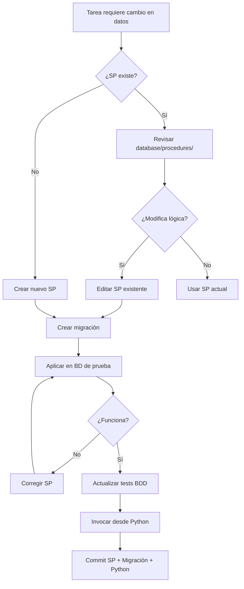

# 🗄️ REGLAS DE BASE DE DATOS (SQL SERVER) - PROYECTO SAM

---
**Versión:** 2.0.0
**Última Actualización:** 2025-01-19
---

## 📋 ÍNDICE

1. [La Regla de Oro](#1-la-regla-de-oro)
2. [Protocolo de Modificación](#2-protocolo-de-modificación)
3. [Plantillas de Stored Procedures](#3-plantillas-de-stored-procedures)
4. [Nomenclatura y Estilo](#4-nomenclatura-y-estilo)
5. [Tablas Críticas](#5-tablas-críticas)
6. [Invocación desde Python](#6-invocación-desde-python)
7. [Optimización y Performance](#7-optimización-y-performance)

---

## 1. LA REGLA DE ORO

### Principio Fundamental

```
┌────────────────────────────────────────────────┐
│  SQL Server = Cerebro del Sistema              │
│  - TODA la lógica de negocio reside aquí      │
│  - Maneja integridad, estados, transacciones  │
│  - Garantiza consistencia de datos            │
└────────────────────────────────────────────────┘
              ↓ solo llamadas a SPs
┌────────────────────────────────────────────────┐
│  Python = Orquestador / Pegamento              │
│  - Llama Stored Procedures                    │
│  - Maneja asincronía                          │
│  - Presenta datos (Web)                       │
│  - NO tiene lógica de negocio                 │
└────────────────────────────────────────────────┘
```

### ¿Por Qué?

| Aspecto | SQL Server | Python |
|---------|-----------|--------|
| **Transacciones ACID** | ✅ Nativo | ❌ Difícil de garantizar |
| **Concurrencia** | ✅ Locks, isolation levels | ❌ Requiere gestión manual |
| **Performance** | ✅ Optimizador de queries | ❌ Más lento en agregaciones |
| **Integridad Referencial** | ✅ Foreign Keys, Triggers | ❌ Solo validación manual |
| **Auditoría** | ✅ Logs centralizados | ❌ Dispersa en múltiples servicios |

---

## 2. PROTOCOLO DE MODIFICACIÓN

### Flujo Completo



### Paso a Paso

#### 1. BUSCAR SP Existente

```bash
# Buscar en archivos
Get-ChildItem database/procedures/ -Filter "*Robot*.sql"

# O buscar en BD
SELECT name FROM sys.procedures WHERE name LIKE '%Robot%'
```

#### 2. CREAR/EDITAR Stored Procedure

**Ubicación:** `database/procedures/dbo_NombreDescriptivo.sql`

**Plantilla Base:**

```sql
-- ============================================
-- Autor:       Tu Nombre
-- Fecha:       2025-01-19
-- Descripción: Descripción clara del propósito
-- Cambios:
--   2025-01-19 - Creación inicial
-- ============================================
CREATE OR ALTER PROCEDURE dbo.NombreDescriptivo
    @Param1 INT,
    @Param2 NVARCHAR(100),
    @Param3 BIT = 0  -- Parámetro opcional con default
AS
BEGIN
    SET NOCOUNT ON;

    BEGIN TRY
        BEGIN TRANSACTION;

        -- ============================================
        -- VALIDACIONES
        -- ============================================
        IF @Param1 <= 0
        BEGIN
            RAISERROR('Param1 debe ser mayor que 0', 16, 1);
            RETURN;
        END

        -- ============================================
        -- LÓGICA PRINCIPAL
        -- ============================================
        UPDATE dbo.Robots
        SET Campo = @Param2
        WHERE RobotId = @Param1;

        -- ============================================
        -- AUDITORÍA (si aplica)
        -- ============================================
        INSERT INTO dbo.AuditoriaLog (Accion, Detalle, FechaRegistro)
        VALUES ('ActualizarRobot', 'RobotId: ' + CAST(@Param1 AS VARCHAR), GETDATE());

        COMMIT TRANSACTION;

        -- Retornar resultado
        SELECT
            RobotId,
            Nombre,
            Campo
        FROM dbo.Robots
        WHERE RobotId = @Param1;

    END TRY
    BEGIN CATCH
        IF @@TRANCOUNT > 0
            ROLLBACK TRANSACTION;

        -- Registrar error
        DECLARE @ErrorMessage NVARCHAR(4000) = ERROR_MESSAGE();
        DECLARE @ErrorSeverity INT = ERROR_SEVERITY();
        DECLARE @ErrorState INT = ERROR_STATE();

        INSERT INTO dbo.ErrorLog (
            ErrorMessage,
            ErrorProcedure,
            ErrorLine,
            FechaRegistro
        )
        VALUES (
            @ErrorMessage,
            ERROR_PROCEDURE(),
            ERROR_LINE(),
            GETDATE()
        );

        -- Re-lanzar error
        RAISERROR(@ErrorMessage, @ErrorSeverity, @ErrorState);
    END CATCH
END
GO
```

#### 3. CREAR Migración

**Ubicación:** `database/migrations/XXX_descripcion.sql`

**Numeración:** Siguiente número disponible (ej: `008_update_robot_logic.sql`)

```sql
-- ============================================
-- Migración: 008
-- Descripción: Actualizar lógica de asignación de equipos
-- Fecha: 2025-01-19
-- Autor: Tu Nombre
-- ============================================

-- Verificar versión actual
IF NOT EXISTS (SELECT 1 FROM dbo.MigracionesAplicadas WHERE Version = 8)
BEGIN
    PRINT 'Aplicando migración 008...';

    -- ============================================
    -- CAMBIOS DE ESQUEMA (si aplica)
    -- ============================================
    IF NOT EXISTS (SELECT 1 FROM sys.columns
                   WHERE object_id = OBJECT_ID('dbo.Robots')
                   AND name = 'NuevoCampo')
    BEGIN
        ALTER TABLE dbo.Robots
        ADD NuevoField NVARCHAR(50) NULL;
        PRINT '- Columna NuevoField agregada';
    END

    -- ============================================
    -- ACTUALIZAR/CREAR SPs
    -- ============================================
    EXEC('
        CREATE OR ALTER PROCEDURE dbo.NombreDescriptivo
        AS
        BEGIN
            -- Código del SP
        END
    ');
    PRINT '- SP dbo.NombreDescriptivo actualizado';

    -- ============================================
    -- DATOS INICIALES (si aplica)
    -- ============================================
    INSERT INTO dbo.ConfiguracionSistema (Clave, Valor)
    VALUES ('NUEVA_CONFIG', 'valor_default');
    PRINT '- Configuración inicial agregada';

    -- ============================================
    -- REGISTRAR MIGRACIÓN
    -- ============================================
    INSERT INTO dbo.MigracionesAplicadas (Version, Descripcion, FechaAplicacion)
    VALUES (8, 'Actualizar lógica de asignación de equipos', GETDATE());

    PRINT 'Migración 008 aplicada exitosamente.';
END
ELSE
BEGIN
    PRINT 'Migración 008 ya fue aplicada previamente.';
END
GO
```

---

## 3. PLANTILLAS DE STORED PROCEDURES

### Plantilla: SELECT (Lectura)

```sql
CREATE OR ALTER PROCEDURE dbo.ObtenerRobotsPorEstado
    @EsOnline BIT = NULL,  -- NULL = todos
    @Activo BIT = 1        -- Default: solo activos
AS
BEGIN
    SET NOCOUNT ON;

    SELECT
        r.RobotId,
        r.Nombre,
        r.PrioridadBalanceo,
        r.MinEquipos,
        r.MaxEquipos,
        r.EsOnline,
        COUNT(a.EquipoId) AS EquiposAsignados
    FROM dbo.Robots r
    LEFT JOIN dbo.Asignaciones a ON r.RobotId = a.RobotId AND a.EsProgramado = 0
    WHERE
        (@EsOnline IS NULL OR r.EsOnline = @EsOnline)
        AND r.ActivoSAM = @Activo
    GROUP BY
        r.RobotId,
        r.Nombre,
        r.PrioridadBalanceo,
        r.MinEquipos,
        r.MaxEquipos,
        r.EsOnline
    ORDER BY r.PrioridadBalanceo ASC;  -- Menor = más prioritario
END
GO
```

### Plantilla: INSERT

```sql
CREATE OR ALTER PROCEDURE dbo.CrearProgramacion
    @RobotId INT,
    @TipoProgramacion NVARCHAR(20),
    @HoraInicio TIME,
    @Tolerancia INT,
    @DiasSemana NVARCHAR(50) = NULL,
    @DiaDelMes INT = NULL,
    @FechaEspecifica DATE = NULL
AS
BEGIN
    SET NOCOUNT ON;

    BEGIN TRY
        BEGIN TRANSACTION;

        -- Validaciones
        IF NOT EXISTS (SELECT 1 FROM dbo.Robots WHERE RobotId = @RobotId AND ActivoSAM = 1)
        BEGIN
            RAISERROR('Robot no existe o está inactivo', 16, 1);
            RETURN;
        END

        IF @TipoProgramacion NOT IN ('Diaria', 'Semanal', 'Mensual', 'Especifica')
        BEGIN
            RAISERROR('Tipo de programación inválido', 16, 1);
            RETURN;
        END

        -- Inserción
        DECLARE @ProgramacionId INT;

        INSERT INTO dbo.Programaciones (
            RobotId,
            TipoProgramacion,
            HoraInicio,
            Tolerancia,
            DiasSemana,
            DiaDelMes,
            FechaEspecifica,
            Activo,
            FechaCreacion
        )
        VALUES (
            @RobotId,
            @TipoProgramacion,
            @HoraInicio,
            @Tolerancia,
            @DiasSemana,
            @DiaDelMes,
            @FechaEspecifica,
            1,  -- Activo por default
            GETDATE()
        );

        SET @ProgramacionId = SCOPE_IDENTITY();

        -- Efecto secundario: Marcar robot como NO online
        UPDATE dbo.Robots
        SET EsOnline = 0
        WHERE RobotId = @RobotId;

        COMMIT TRANSACTION;

        -- Retornar programación creada
        SELECT
            p.*,
            r.Nombre AS NombreRobot
        FROM dbo.Programaciones p
        INNER JOIN dbo.Robots r ON p.RobotId = r.RobotId
        WHERE p.ProgramacionId = @ProgramacionId;

    END TRY
    BEGIN CATCH
        IF @@TRANCOUNT > 0
            ROLLBACK TRANSACTION;

        INSERT INTO dbo.ErrorLog (ErrorMessage, ErrorProcedure, ErrorLine, FechaRegistro)
        VALUES (ERROR_MESSAGE(), ERROR_PROCEDURE(), ERROR_LINE(), GETDATE());

        THROW;
    END CATCH
END
GO
```

### Plantilla: UPDATE

```sql
CREATE OR ALTER PROCEDURE dbo.ActualizarPrioridadRobot
    @RobotId INT,
    @NuevaPrioridad INT
AS
BEGIN
    SET NOCOUNT ON;

    BEGIN TRY
        BEGIN TRANSACTION;

        -- Validaciones
        IF @NuevaPrioridad < 1 OR @NuevaPrioridad > 100
        BEGIN
            RAISERROR('Prioridad debe estar entre 1 y 100', 16, 1);
            RETURN;
        END

        IF NOT EXISTS (SELECT 1 FROM dbo.Robots WHERE RobotId = @RobotId)
        BEGIN
            RAISERROR('Robot no existe', 16, 1);
            RETURN;
        END

        -- Capturar valor anterior para auditoría
        DECLARE @PrioridadAnterior INT;
        SELECT @PrioridadAnterior = PrioridadBalanceo
        FROM dbo.Robots
        WHERE RobotId = @RobotId;

        -- Actualización
        UPDATE dbo.Robots
        SET
            PrioridadBalanceo = @NuevaPrioridad,
            FechaModificacion = GETDATE()
        WHERE RobotId = @RobotId;

        -- Auditoría
        INSERT INTO dbo.AuditoriaLog (Tabla, Accion, Detalle, FechaRegistro)
        VALUES (
            'Robots',
            'UPDATE',
            'RobotId: ' + CAST(@RobotId AS VARCHAR) +
            ', Prioridad: ' + CAST(@PrioridadAnterior AS VARCHAR) +
            ' → ' + CAST(@NuevaPrioridad AS VARCHAR),
            GETDATE()
        );

        COMMIT TRANSACTION;

        -- Retornar registro actualizado
        SELECT * FROM dbo.Robots WHERE RobotId = @RobotId;

    END TRY
    BEGIN CATCH
        IF @@TRANCOUNT > 0
            ROLLBACK TRANSACTION;

        INSERT INTO dbo.ErrorLog (ErrorMessage, ErrorProcedure, ErrorLine, FechaRegistro)
        VALUES (ERROR_MESSAGE(), ERROR_PROCEDURE(), ERROR_LINE(), GETDATE());

        THROW;
    END CATCH
END
GO
```

### Plantilla: DELETE

```sql
CREATE OR ALTER PROCEDURE dbo.EliminarProgramacion
    @ProgramacionId INT
AS
BEGIN
    SET NOCOUNT ON;

    BEGIN TRY
        BEGIN TRANSACTION;

        -- Validar existencia
        IF NOT EXISTS (SELECT 1 FROM dbo.Programaciones WHERE ProgramacionId = @ProgramacionId)
        BEGIN
            RAISERROR('Programación no existe', 16, 1);
            RETURN;
        END

        -- Capturar datos para auditoría
        DECLARE @RobotId INT, @TipoProgramacion NVARCHAR(20);
        SELECT
            @RobotId = RobotId,
            @TipoProgramacion = TipoProgramacion
        FROM dbo.Programaciones
        WHERE ProgramacionId = @ProgramacionId;

        -- Eliminar asignaciones relacionadas
        DELETE FROM dbo.Asignaciones
        WHERE ProgramacionId = @ProgramacionId AND EsProgramado = 1;

        -- Eliminar programación
        DELETE FROM dbo.Programaciones
        WHERE ProgramacionId = @ProgramacionId;

        -- Verificar si robot tiene otras programaciones
        IF NOT EXISTS (SELECT 1 FROM dbo.Programaciones WHERE RobotId = @RobotId AND Activo = 1)
        BEGIN
            -- Si no tiene más programaciones, potencialmente volver a EsOnline=1
            -- (Requiere decisión de negocio: ¿automático o manual?)
            PRINT 'Robot sin programaciones activas. Considerar actualizar EsOnline manualmente.';
        END

        -- Auditoría
        INSERT INTO dbo.AuditoriaLog (Tabla, Accion, Detalle, FechaRegistro)
        VALUES (
            'Programaciones',
            'DELETE',
            'ProgramacionId: ' + CAST(@ProgramacionId AS VARCHAR) +
            ', RobotId: ' + CAST(@RobotId AS VARCHAR) +
            ', Tipo: ' + @TipoProgramacion,
            GETDATE()
        );

        COMMIT TRANSACTION;

        SELECT 'Programación eliminada exitosamente' AS Resultado;

    END TRY
    BEGIN CATCH
        IF @@TRANCOUNT > 0
            ROLLBACK TRANSACTION;

        INSERT INTO dbo.ErrorLog (ErrorMessage, ErrorProcedure, ErrorLine, FechaRegistro)
        VALUES (ERROR_MESSAGE(), ERROR_PROCEDURE(), ERROR_LINE(), GETDATE());

        THROW;
    END CATCH
END
GO
```

### Plantilla: Table-Valued Parameters (Operaciones Masivas)

```sql
-- 1. Definir el tipo de tabla (ejecutar UNA VEZ)
CREATE TYPE dbo.EquipoIdList AS TABLE
(
    EquipoId INT NOT NULL
);
GO

-- 2. Crear SP que usa el tipo
CREATE OR ALTER PROCEDURE dbo.AsignarEquiposAProgram acion
    @ProgramacionId INT,
    @Equipos dbo.EquipoIdList READONLY  -- TVP
AS
BEGIN
    SET NOCOUNT ON;

    BEGIN TRY
        BEGIN TRANSACTION;

        -- Validar programación existe
        DECLARE @RobotId INT;
        SELECT @RobotId = RobotId
        FROM dbo.Programaciones
        WHERE ProgramacionId = @ProgramacionId;

        IF @RobotId IS NULL
        BEGIN
            RAISERROR('Programación no existe', 16, 1);
            RETURN;
        END

        -- Eliminar asignaciones actuales de esta programación
        DELETE FROM dbo.Asignaciones
        WHERE ProgramacionId = @ProgramacionId AND EsProgramado = 1;

        -- Insertar nuevas asignaciones
        INSERT INTO dbo.Asignaciones (RobotId, EquipoId, ProgramacionId, EsProgramado, FechaAsignacion)
        SELECT
            @RobotId,
            e.EquipoId,
            @ProgramacionId,
            1,
            GETDATE()
        FROM @Equipos e
        INNER JOIN dbo.Equipos eq ON e.EquipoId = eq.EquipoId
        WHERE eq.Activo_SAM = 1;  -- Solo equipos activos

        -- Marcar equipos como no balanceables
        UPDATE dbo.Equipos
        SET PermiteBalanceoDinamico = 0
        WHERE EquipoId IN (SELECT EquipoId FROM @Equipos);

        COMMIT TRANSACTION;

        -- Retornar asignaciones creadas
        SELECT
            a.AsignacionId,
            a.EquipoId,
            e.Nombre AS NombreEquipo
        FROM dbo.Asignaciones a
        INNER JOIN dbo.Equipos e ON a.EquipoId = e.EquipoId
        WHERE a.ProgramacionId = @ProgramacionId AND a.EsProgramado = 1;

    END TRY
    BEGIN CATCH
        IF @@TRANCOUNT > 0
            ROLLBACK TRANSACTION;

        INSERT INTO dbo.ErrorLog (ErrorMessage, ErrorProcedure, ErrorLine, FechaRegistro)
        VALUES (ERROR_MESSAGE(), ERROR_PROCEDURE(), ERROR_LINE(), GETDATE());

        THROW;
    END CATCH
END
GO
```

---

## 4. NOMENCLATURA Y ESTILO

### Nombres de Stored Procedures

```
✅ BIEN:
dbo.ObtenerRobotsEjecutables
dbo.ActualizarPrioridadRobot
dbo.CrearProgramacion
dbo.EliminarAsignacion

❌ MAL:
sp_GetRobots               -- Evitar prefijo sp_ (reservado por sistema)
obtener_robots             -- No usar snake_case
getRobots                  -- No usar camelCase
```

**Convenciones:**
- **Verbo** + **Sustantivo** en español
- PascalCase
- Sin prefijo `sp_` (puede confundirse con SPs de sistema)
- Nombre de archivo: `dbo_NombreDelSP.sql` (opcional pero recomendado)

### Nombres de Parámetros

```sql
-- ✅ BIEN
CREATE PROCEDURE dbo.ObtenerRobots
    @EsOnline BIT = NULL,
    @LimiteResultados INT = 100

-- ❌ MAL
CREATE PROCEDURE dbo.ObtenerRobots
    @online BIT,            -- Sin prefijo @
    @limit INT              -- Nombre en inglés inconsistente
```

**Convenciones:**
- Prefijo `@`
- PascalCase
- Español (consistente con nombres de tablas/columnas)

### Formato de Código SQL

```sql
-- ✅ BIEN: Indentación clara
SELECT
    r.RobotId,
    r.Nombre,
    COUNT(a.EquipoId) AS TotalEquipos
FROM dbo.Robots r
LEFT JOIN dbo.Asignaciones a
    ON r.RobotId = a.RobotId
    AND a.EsProgramado = 0
WHERE r.ActivoSAM = 1
GROUP BY
    r.RobotId,
    r.Nombre
ORDER BY r.PrioridadBalanceo ASC;

-- ❌ MAL: Todo en una línea
SELECT r.RobotId, r.Nombre, COUNT(a.EquipoId) AS TotalEquipos FROM dbo.Robots r LEFT JOIN dbo.Asignaciones a ON r.RobotId = a.RobotId WHERE r.ActivoSAM = 1 GROUP BY r.RobotId, r.Nombre;
```

### Comentarios

```sql
-- Comentarios de línea para explicaciones breves
SELECT * FROM dbo.Robots; -- Solo robots activos

/*
Comentarios de bloque para:
- Explicaciones largas
- Lógica compleja
- TODOs
*/
```

---

## 5. TABLAS CRÍTICAS

### ⚠️ Modificar con Extremo Cuidado

| Tabla | Propósito | Riesgo de Modificación |
|-------|-----------|----------------------|
| **dbo.Ejecuciones** | Historial central de todas las ejecuciones | 🔴 ALTO - Trazabilidad completa |
| **dbo.Programaciones** | Define qué robots corren y cuándo | 🔴 ALTO - Afecta producción |
| **dbo.ConfiguracionSistema** | Flags globales del orquestador | 🟡 MEDIO - Cambios en caliente |
| **dbo.Robots** | Catálogo maestro de robots | 🟡 MEDIO - Sincronizado con A360 |
| **dbo.Equipos** | Catálogo maestro de devices | 🟡 MEDIO - Sincronizado con A360 |
| **dbo.Asignaciones** | Relación Robot ↔ Equipo | 🟡 MEDIO - Cambia dinámicamente |

### Reglas Específicas

#### dbo.Ejecuciones

```sql
-- ✅ PERMITIDO: Consultas de lectura
SELECT * FROM dbo.Ejecuciones
WHERE FechaInicio >= DATEADD(DAY, -7, GETDATE());

-- ⚠️ REQUIERE APROBACIÓN: Modificar estados manualmente
UPDATE dbo.Ejecuciones
SET Estado = 'COMPLETED'
WHERE DeploymentId = '12345' AND Estado = 'UNKNOWN';

-- ❌ PROHIBIDO: Eliminar registros (se pierde trazabilidad)
DELETE FROM dbo.Ejecuciones WHERE FechaInicio < '2024-01-01';
```

#### dbo.ConfiguracionSistema

```sql
-- ✅ PERMITIDO: Cambios de configuración
UPDATE dbo.ConfiguracionSistema
SET Valor = 'true'
WHERE Clave = 'BALANCEADOR_POOL_AISLAMIENTO_ESTRICTO';

-- ✅ PERMITIDO: Agregar nuevas claves
INSERT INTO dbo.ConfiguracionSistema (Clave, Valor, Descripcion)
VALUES ('NUEVA_CONFIG', 'valor', 'Descripción clara');

-- ❌ EVITAR: Eliminar configuraciones (pueden romper servicios)
DELETE FROM dbo.ConfiguracionSistema WHERE Clave = 'BALANCEADOR_LOG_LEVEL';
```

---

## 6. INVOCACIÓN DESDE PYTHON

### Ejemplo Completo

```python
# src/sam/common/database.py
from typing import Dict, List, Optional
import pyodbc

class DatabaseRepository:
    async def execute_sp(
        self,
        sp_name: str,
        params: Optional[Dict[str, any]] = None
    ) -> List[Dict[str, any]]:
        """
        Ejecuta un Stored Procedure.

        Args:
            sp_name: Nombre del SP (ej: "dbo.ObtenerRobots")
            params: Diccionario de parámetros

        Returns:
            Lista de diccionarios con los resultados
        """
        if params is None:
            params = {}

        # Construir llamada
        param_placeholders = ', '.join([f'@{k}=?' for k in params.keys()])
        query = f"EXEC {sp_name} {param_placeholders}"

        # Ejecutar
        conn = self.get_connection()
        cursor = conn.cursor()

        try:
            cursor.execute(query, list(params.values()))

            # Obtener resultados
            columns = [column[0] for column in cursor.description]
            results = []
            for row in cursor.fetchall():
                results.append(dict(zip(columns, row)))

            conn.commit()
            return results

        except Exception as e:
            conn.rollback()
            raise
        finally:
            cursor.close()
            conn.close()

# Uso en código de servicio
async def obtener_robots_online():
    db = DatabaseRepository()
    robots = await db.execute_sp(
        "dbo.ObtenerRobotsPorEstado",
        {"EsOnline": 1, "Activo": 1}
    )
    return robots
```

### ❌ ANTI-PATRÓN: SQL Crudo en Python

```python
# ❌ NUNCA HACER ESTO
async def obtener_robots_mal():
    query = f"SELECT * FROM dbo.Robots WHERE EsOnline = 1"  # SQL Injection risk
    cursor.execute(query)

# ❌ TAMPOCO ESTO
async def actualizar_robot_mal(robot_id, prioridad):
    query = f"UPDATE dbo.Robots SET PrioridadBalanceo = {prioridad} WHERE RobotId = {robot_id}"
    cursor.execute(query)
```

**Razones:**
1. **Seguridad:** Vulnerable a SQL Injection
2. **Mantenibilidad:** Lógica duplicada (SQL + Python)
3. **Testing:** Difícil de testear
4. **Auditoría:** Sin logging centralizado

---

## 7. OPTIMIZACIÓN Y PERFORMANCE

### Índices

```sql
-- Crear índice en columna frecuentemente consultada
CREATE NONCLUSTERED INDEX IX_Ejecuciones_FechaInicio
ON dbo.Ejecuciones (FechaInicio DESC)
INCLUDE (RobotId, Estado);

-- Verificar uso de índices
SET STATISTICS IO ON;
EXEC dbo.ObtenerRobotsEjecutables;
-- Revisar "logical reads" en Messages
```

### Evitar SELECT *

```sql
-- ❌ MAL: Trae todas las columnas (incluso las no usadas)
SELECT * FROM dbo.Robots;

-- ✅ BIEN: Solo las columnas necesarias
SELECT RobotId, Nombre, PrioridadBalanceo FROM dbo.Robots;
```

### Usar EXISTS en lugar de COUNT

```sql
-- ❌ LENTO: Cuenta todos los registros
IF (SELECT COUNT(*) FROM dbo.Programaciones WHERE RobotId = @RobotId) > 0
    PRINT 'Tiene programaciones';

-- ✅ RÁPIDO: Se detiene al encontrar el primero
IF EXISTS (SELECT 1 FROM dbo.Programaciones WHERE RobotId = @RobotId)
    PRINT 'Tiene programaciones';
```

### Limitar Resultados

```sql
-- Siempre usar TOP cuando no necesitas todos los registros
SELECT TOP 100 * FROM dbo.Ejecuciones
ORDER BY FechaInicio DESC;
```

---

## 📋 CHECKLIST ANTES DE COMMIT

- [ ] **Archivo SP:** Creado en `database/procedures/`
- [ ] **Migración:** Creada en `database/migrations/`
- [ ] **Transacciones:** Uso BEGIN TRAN...COMMIT/ROLLBACK
- [ ] **Manejo de Errores:** TRY...CATCH con logging a dbo.ErrorLog
- [ ] **Validaciones:** Parámetros validados antes de ejecutar lógica
- [ ] **Nomenclatura:** PascalCase en español
- [ ] **Comentarios:** Encabezado con autor, fecha, descripción
- [ ] **Optimización:** No uso SELECT *, uso EXISTS en lugar de COUNT
- [ ] **Testing:** SP probado en BD de desarrollo
- [ ] **Python:** Código Python actualizado para invocar el nuevo/
