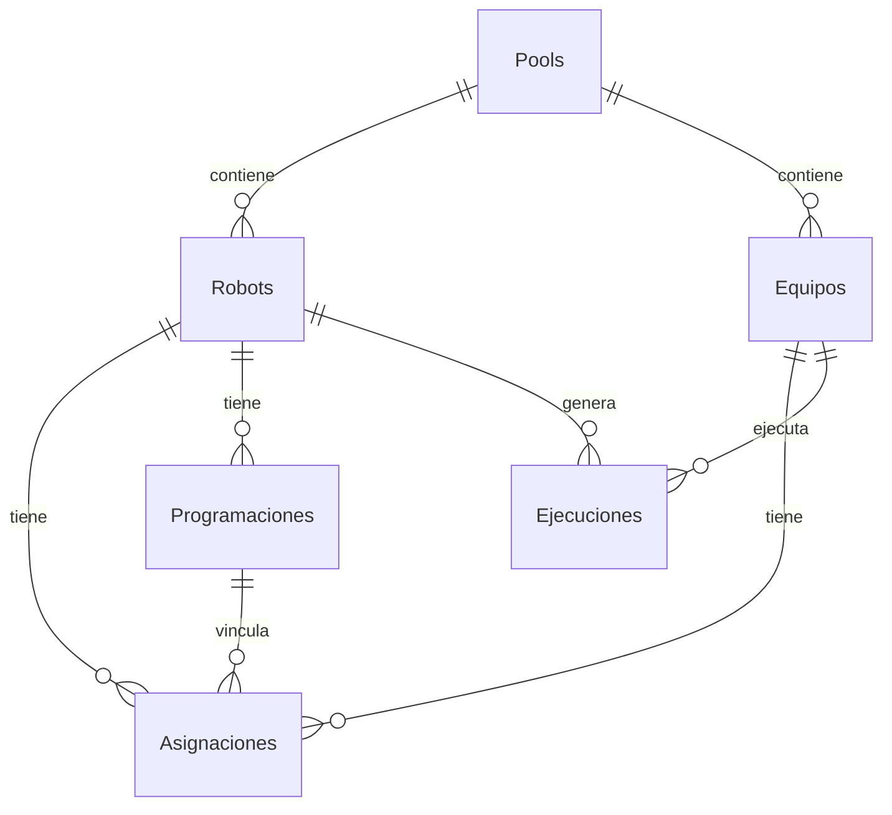

# 🗄️ MODELO DE BASE DE DATOS (DETALLADO)

---
**Versión:** 1.0.0
**Última Actualización:** 2025-01-19
---

Este documento detalla la estructura completa de la base de datos de SAM, incluyendo columnas, tipos de datos y relaciones.

## 📊 DIAGRAMA DE ENTIDAD-RELACIÓN (RESUMEN)

---

## 🏗️ TABLAS MAESTRAS

### 1. `dbo.Robots`
Catálogo de robots gestionados por SAM.
- `RobotId` (int, PK): ID único del bot en Automation Anywhere.
- `Robot` (nvarchar 100): Nombre del bot.
- `Descripcion` (nvarchar 4000): Descripción opcional.
- `Parametros` (nvarchar max): JSON con los parámetros de entrada (`bot_input`).
- `Activo` (bit): Indica si el robot está habilitado en SAM.
- `EsOnline` (bit): 1 si es por demanda (balanceable), 0 si es solo programado.
- `MinEquipos` (int): Mínimo de equipos que el balanceador intentará mantener.
- `MaxEquipos` (int): Límite máximo de equipos para el balanceador.
- `PrioridadBalanceo` (int): Prioridad (1-100, menor es más prioritario).
- `TicketsPorEquipoAdicional` (int): Ratio para el algoritmo de escalado.
- `PoolId` (int, FK): Pool al que pertenece el robot.

### 2. `dbo.Equipos`
Catálogo de Bot Runners (Devices).
- `EquipoId` (int, PK): ID único del dispositivo en Automation Anywhere.
- `Equipo` (nvarchar 100): Nombre del equipo/host.
- `UserId` (int): ID del usuario de A360 asignado al equipo.
- `UserName` (nvarchar 50): Nombre del usuario de A360.
- `Licencia` (nvarchar 50): Tipo de licencia (Bot Runner).
- `Activo_SAM` (bit): 1 si el equipo está disponible para SAM.
- `EstadoBalanceador` (nvarchar 50): Estado interno (ej. "AsignadoDinamico").
- `PermiteBalanceoDinamico` (bit): 1 si el equipo puede ser movido por el balanceador.
- `PoolId` (int, FK): Pool al que pertenece el equipo.

### 3. `dbo.Pools`
Agrupaciones lógicas de recursos.
- `PoolId` (int, PK): ID autoincremental.
- `Nombre` (nvarchar 100): Nombre del pool.
- `Aislamiento` (bit): 1 si el pool es estricto (no comparte equipos).

---

## ⚙️ CONFIGURACIÓN Y RELACIONES

### 4. `dbo.Asignaciones`
Relación dinámica entre Robots y Equipos.
- `RobotId` (int, FK)
- `EquipoId` (int, FK)
- `EsProgramado` (bit): 1 si la asignación es fija por una programación.
- `Reservado` (bit): Uso interno para procesos de bloqueo.
- `FechaAsignacion` (datetime2)
- `AsignadoPor` (nvarchar 50): "Balanceador", "Manual" o "Sistema".
- `ProgramacionId` (int, FK): Vínculo con la tabla de programaciones.

### 5. `dbo.Programaciones`
Definición de ventanas temporales de ejecución.
- `ProgramacionId` (int, PK)
- `RobotId` (int, FK)
- `TipoProgramacion` (nvarchar 20): Diaria, Semanal, Mensual, Especifica, RangoMensual.
- `HoraInicio` (time)
- `HoraFin` (time): Para ejecuciones cíclicas.
- `DiasSemana` (nvarchar 20): "Lu,Ma,Mi,Ju,Vi,Sa,Do".
- `DiaDelMes` (int)
- `FechaEspecifica` (date)
- `Tolerancia` (int): Minutos permitidos de retraso.
- `Activo` (bit)
- `EsCiclico` (bit): 1 si debe re-ejecutarse dentro de la ventana.
- `IntervaloEntreEjecuciones` (int): Minutos de espera entre ciclos.

### 6. `dbo.MapeoRobots`
Traducción de nombres externos (ej. Clouders) a IDs internos.
- `MapeoId` (int, PK)
- `NombreExterno` (nvarchar 255)
- `RobotId` (int, FK)

---

## 📈 OPERACIONES Y LOGS

### 7. `dbo.Ejecuciones`
Registro histórico de cada lanzamiento.
- `EjecucionId` (int, PK)
- `DeploymentId` (nvarchar 50): ID de ejecución en A360.
- `RobotId` (int, FK)
- `EquipoId` (int, FK)
- `Estado` (nvarchar 20): DEPLOYED, RUNNING, COMPLETED, FAILED, UNKNOWN, etc.
- `FechaInicio` (datetime2): Inicio registrado por SAM.
- `FechaFin` (datetime2): Fin registrado por Callback.
- `CallbackInfo` (nvarchar max): JSON completo recibido de A360.
- `IntentosConciliadorFallidos` (int): Contador para inferencia de fin.

### 8. `dbo.Auditoria`
Registro de cambios realizados desde la interfaz web.
- `AuditoriaId` (int, PK)
- `Fecha` (datetime)
- `Usuario` (nvarchar 100)
- `Accion` (nvarchar 50)
- `Tabla` (nvarchar 50)
- `Detalle` (nvarchar max)
- `Host` (nvarchar 100)

### 9. `dbo.ErrorLog`
Errores capturados en Stored Procedures.
- `ErrorLogID` (int, PK)
- `ErrorNumber` (int)
- `ErrorMessage` (nvarchar 4000)
- `ErrorProcedure` (nvarchar 128)
- `ErrorTime` (datetime)

---

## 🛠️ TABLAS DE SISTEMA

- `dbo.ConfiguracionSistema`: Pares Key-Value para comportamiento global.
- `dbo.HistoricoBalanceo`: Log de decisiones tomadas por el balanceador.
- `dbo.Ejecuciones_Historico`: Almacena registros movidos diariamente desde `dbo.Ejecuciones` (tras 1 día de antigüedad). Se purga definitivamente a los 15 días.
